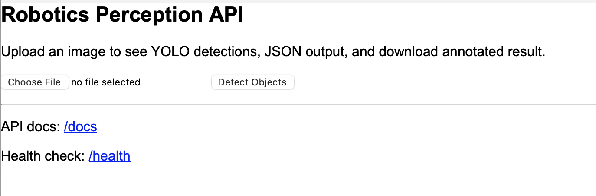
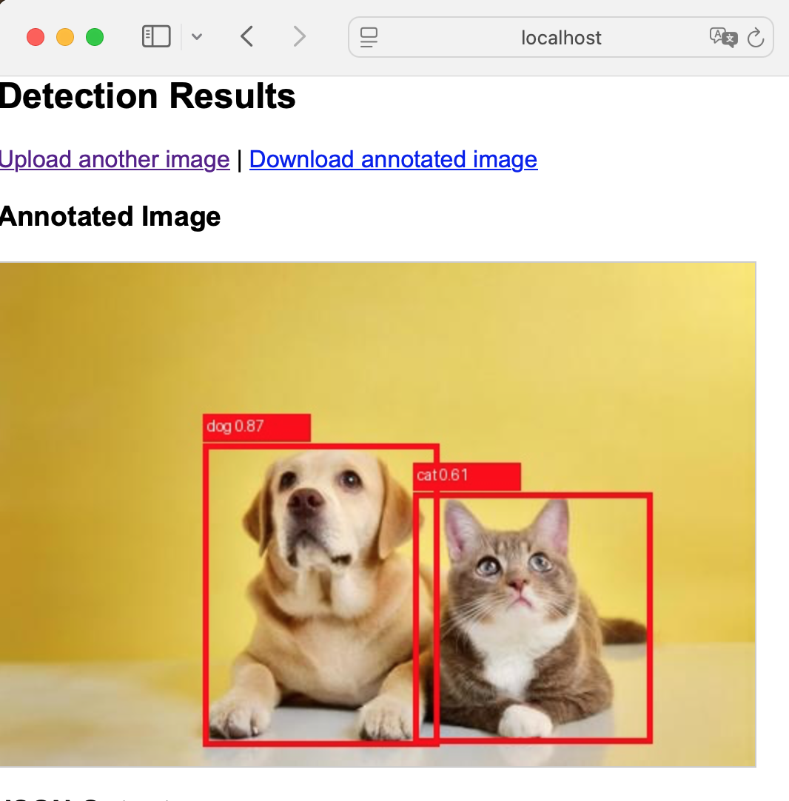
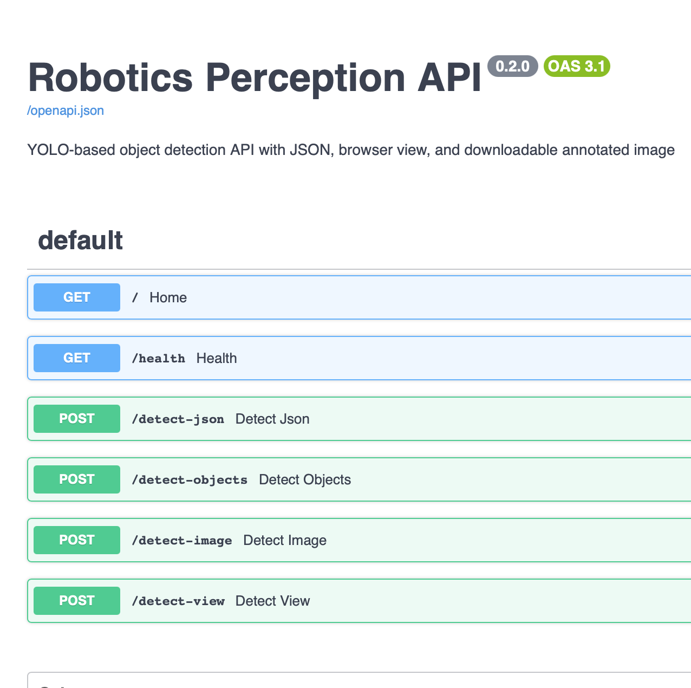
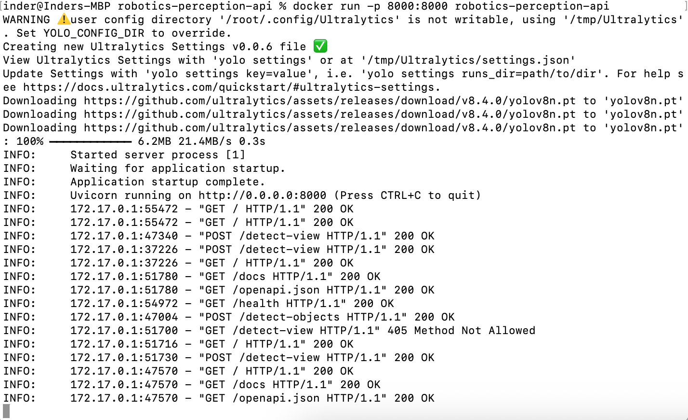

# 🤖 Robotics Perception API


A Dockerized computer vision API for robotics-style perception using YOLO object detection and FastAPI.

This project demonstrates how a trained deep learning model can be exposed as a production-style API, containerized with Docker, and accessed through both browser and API endpoints.

## 🌟 Overview

The application allows users to upload an image and receive object detection results in multiple formats:

- JSON response with detected objects, confidence scores, and bounding boxes
- Browser-based visualization with bounding boxes drawn on the image
- Downloadable annotated image
- Swagger API documentation for testing endpoints

This project was built to demonstrate practical AI deployment skills, including model serving, API design, Docker containerization, and cloud-readiness.

## ✨ Features

- YOLO-based object detection
- FastAPI backend
- Browser image upload interface
- JSON API response
- Bounding box visualization
- Annotated image download
- Swagger UI documentation
- Dockerized deployment
- Health check endpoint
- Model versioning and inference latency reporting

## 🛠️ Tech Stack

- Python
- FastAPI
- Ultralytics YOLO
- PyTorch
- Pillow
- Docker
- Uvicorn

## 📂 Project Structure

```text
robotics-perception-api/
│
├── app/
│   ├── __init__.py
│   └── main.py
│
├── sample_images/
│   └── test.jpg
│
├── Dockerfile
├── requirements.txt
├── README.md
└── .gitignore
```

## 🔌 API Endpoints

| Method | Endpoint | Description |
|---|---|---|
| GET | `/` | Browser upload interface |
| GET | `/health` | Health check |
| POST | `/detect-json` | Returns object detection results as JSON |
| POST | `/detect-objects` | Returns object detection results as JSON |
| POST | `/detect-image` | Returns annotated image with bounding boxes |
| POST | `/detect-view` | Browser view with image, detections, and download option |
| GET | `/docs` | Swagger API documentation |

## 📋 Example JSON Output

```json
{
  "request_id": "abc-123",
  "model_version": "yolov8n",
  "num_detections": 3,
  "inference_time_ms": 142.5,
  "detections": [
    {
      "label": "person",
      "confidence": 0.91,
      "bbox": {
        "x1": 125.4,
        "y1": 80.2,
        "x2": 340.7,
        "y2": 520.1
      }
    }
  ]
}
```

## 🚀 Run Locally

Create and activate a Python environment, then install dependencies:

```bash
pip install -r requirements.txt
```

Run the FastAPI app:

```bash
uvicorn app.main:app --host 127.0.0.1 --port 8000
```

Open in browser:

```text
http://127.0.0.1:8000/
```

Swagger API docs:

```text
http://127.0.0.1:8000/docs
```

## 🐳 Run with Docker

Build the Docker image:

```bash
docker build -t robotics-perception-api .
```

Run the container:

```bash
docker run -p 8000:8000 robotics-perception-api
```

Open:

```text
http://127.0.0.1:8000/
```

## 🎯 Example Use Case

This project represents a simplified robotics perception service where an image frame can be sent to an object detection model, and the API returns detected objects with locations and confidence scores.

Such a service can be extended for:

- Robotics perception pipelines
- Autonomous navigation prototypes
- Visual inspection systems
- Edge AI model serving
- Cloud-based computer vision APIs

## 🖼️ Screenshots

<table>
<tr>
<td></td>
<td></td>
</tr>
<tr>
<td align="center">🏠 Home Page</td>
<td align="center">🎯 Detection Result</td>
</tr>
</table>

<table>
<tr>
<td></td>
<td></td>
</tr>
<tr>
<td align="center">📚 Swagger UI</td>
<td align="center">🐳 Docker Running</td>
</tr>
</table>

## 🔮 Future Improvements

- Deploy to Azure Container Apps
- Add CI/CD using GitHub Actions
- Add request logging and monitoring
- Add batch image processing
- Add video frame detection
- Add model selection support
- Add authentication for API access

## 💡 What This Project Demonstrates

This project demonstrates the ability to:

- Serve a trained computer vision model through an API
- Build a browser-accessible AI application
- Return structured model predictions as JSON
- Generate visual outputs with bounding boxes
- Package an AI application with Docker
- Prepare an ML service for cloud deployment

## 👨‍💻 Author
Dr. Inder Pal Singh

PhD in Computer Science with focus on AI, Machine Learning, and Computer Vision.